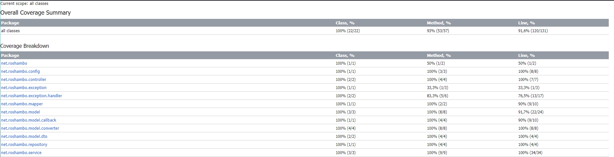

# ROSHAMBO
##### Japanese version of the name "rock paper scissors".

---

## Technologies stack:

- Spring Boot
- Spring Webflux
- Spring Data R2DBC
- Testcontainers
- Maven
- PostgreSQL

---

## Advantages

- **Scalability**: WebFlux, with its reactive architecture, offers good scalability, making it easy to scale.

- **REST API**: Using a REST API makes the game accessible to players from different platforms and devices.

- **Game History**: Having access to the history of all games can be useful for analysis, improving gaming strategy, compiling statistics, and simply for entertainment.

- **Support for History Clearing**: The ability to clear game history can be useful for resetting data before starting a new season.

- **Ease of Implementation**: Using REST API allows for easy integration of the game into existing web applications or services.

## Disadvantages

- **Network Dependency**: Since the game is implemented through network interaction, the reliability and performance of the game may depend on the quality of the network connection.

- **Limited Capabilities for Advanced Game Logic**: There may be limitations in implementing complex game logic when using REST API, requiring deeper interaction between the server and clients.

- **Support for Only Two Players**: Limiting the number of players (only two players) it's a drawback for games oriented on multiplayer gaming.

- **Lack of a GUI**: The need to create a GUI for normal use of the service.
  
---

https://github.com/Maslyna/rock-paper-scissors/assets/102993813/d3974363-fc2f-4057-85d3-5edcfbb12977

---

## Code coverage

